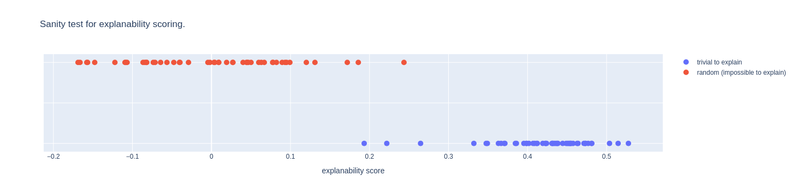

Note: to see the graphs in the notebook, download it and open it with VSCode.

# Sparse Autoencoders with Whole Model Reconstruction Loss

## Motivation

Sparse autoencoders are trained to minimize reconstruction loss on activations.
However, what matters most is (arguably) how the sparse autoencoder affects the behavior of the whole model.
So we train sparse autoencoders whose reconstruction loss is the KL divergence between the output of the whole model and the output of the whole model when run with the autoencoder.
Let's call this loss the whole model reconstruction loss.
We expect this method to produce autoencoders with smaller whole model reconstruction loss for the same sparsities than the standard approach.
One could also expect in a much more speculative way that, at equal saprsity, the features found by our approach would be more interpretable because sparse autoencoders have to represent the noise that is there in the model and if we look at the whole model reconstruction loss, we could expect less of the noise at layer i to be relevant than if we looked at activation reconstruction loss at layer i.

## Details

We train the following types of sparse autoencoders:

- **Standard:** The classical way of training sparse autoencoders, with L2 reconstruction loss between the reconstruction and activations. This is the baseline.
- **Frozen:** A sparse autoencoder whose reconstruction loss is the KL divergence between the output of the whole model with the autoencoder and the output of the whole model without the autoencoder.
- **Intrusive:** Like a frozen sparse autoencoder, but we also train the half layers (i.e. attention or mlp blocks) neighboring the autoencoder. We expect this to lead to much sparser and low reconstruction loss sparse autoencoders since now the neighboring layers can be modified to encode information in a way more suitable for the sparse autoencoder. However, now we are doing interpretability on a model which only works with sparse autoencoders in it, not on the original model.
- **Non Intrusive:** Like an intrusive sparse autoencoder, but we have two reconstruction losses (which are combined in a weighed sum to get the final loss): one between the output of the model with trained half layers and no autoencoder and the original model and one between the output of the model with trained layers and the autoencoder and the output of the original model. This way, we have the conjectured benefits of the intrusive method for the sparse autoencoder but we still get a "fine-tuned" version of the original model which's output is (hopefully) close to that of the original model. If the outputs are close enough and fetaures found by sparse autoencoders are useful, this could be a rather small alignment tax. We get what could be thought of as a model fine-tuned for interpretability.

For frozen, intrusive, and non intrusive training, we initialize the weights of the autoencoder with those of an autoencoder trained in the standard way in hopes to make convergence faster (this is what we call pretraining the autoencoder in the notebook).
In a more serious experiment, it would make more sense to initialize the intrusive and non intrusive sparse autoencoders in such a way that they behave like the identity function because we don't want the trained half layers to be wrecked early in training when the sparse autoencoder is not perfectly adapted to them.

We could also directly use next token prediction loss instead of the KL divergence between the output of the original model and that of the model with a sparse autoencoder.
This could lead to the alignment tax of training a non intrusive sparse autoencoder to be non existant if the next token prediction loss of the model "fine tuned for interpretability" is as low as that of the original model.
We could also expect to maybe find more interpretable features because now the sparse autoencoder and model "fine tuned for interpretability" don't have to care for reproducing the noise that was there in the original model.
We implemented this but didn't run it because we expected it to require a lot of compute to outperform the KL divergence methods (before convergence, we even expect it to perform worse than KL divergence methods at equal training time because the former is training and the latter is distillation, and distillation requires much less training time).

## Results

We train standard, frozen, intrusive, and non intrusive sparse autoencoders on checkpoints `blocks.0.hook_resid_mid`, `blocks.1.hook_resid_pre`, and `blocks.3.hook_resid_post` of `TinyStories-1M`.
The hidden dimension of all autoencoders is `8 * d_model` (and `d_model = 64`).
It would be better to take more diverse checkpoints (one near the first layer, one in the middle, one near the last, at least one on the residual stream, at least one at the attention or mlp output).
But we feared that this would make hyperparameter tuning harder. We guess that those fears maybe confirmed themselves because some autoencoders did not converge on the third checkpoint but did on the first two with the same hyperparameters. It would be reasonable this to be even stronger if they were even further away in the model.

We plot the whole model reconstruction loss and the interpretability scores as measured with OpenAI's autointerpretability framework.
Unfortunately, OpenAI's autointerpretability framework produced scores with a huge variance for different sparse autoencoder features, so the error bars are huge.

Unfortunately, some autoencoders on the third checkpoint were diverging and there was a technical problem with the remote jupyter notebook when testing the autoencoders on the second checkpoint, so we only have results on the first checkpoint.

Unfortunately, our approach did not give better results than the standard way to train sparse autoencoders.

Note that the training time for the sparse autoencoders with whole model reconstruction loss was only a few times bigger than than of the standard autoencoder.
We expect our approach to require orders of magnitude more training time to converge because we have to compute gradients through the whole model at each training step and thus the training steps take longer and also because intrusive and non intrusive sparse autoencoders train neighboring half layers in addition to the sparse autoencoder.

Note that no sparse autoencoder was trained to convergence, which is plausibly quite important because Anthropic say that scale matters in their dictionary learning paper and since it is a common heuristic in interpretability that models trained closer to convergence internally represent things in a cleaner and less noisy way.

## Time Spent and Originality of Ideas

This project was done for my application to Neel Nanda's MATS stream.

I spent 16 hours writing code, thinking about the code, and writing this writeup. I also spent **a lot** of time waiting for it to finish computing, looking at the training loss graphs for one minute, tweaking a hyperparameter, and relaunching the several hour computation.

I came up with the idea of training sparse autoencoders with whole model reconstruction loss instead of activation reconstruction loss on my own.
After a quick search, I saw that (unsurprisingly) a few other people on lesswrong, namely Lee Sharkey, have already had and discussed it before me.
However, I do not know any published work on this idea (but Lee Sharkey's [recent post](https://www.lesswrong.com/posts/64MizJXzyvrYpeKqm/sparsify-a-mechanistic-interpretability-research-agenda) says that there is an upcoming post with exactly that.
I am not aware of any discussion of different specific ways to train sparse autoencoders with whole model reconstruction loss such as frozen vs intrusive vs non intrusive.
